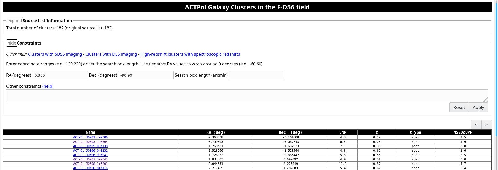
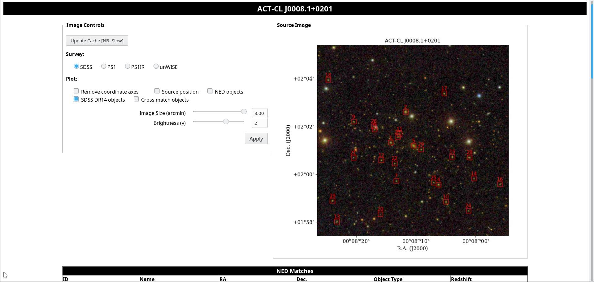
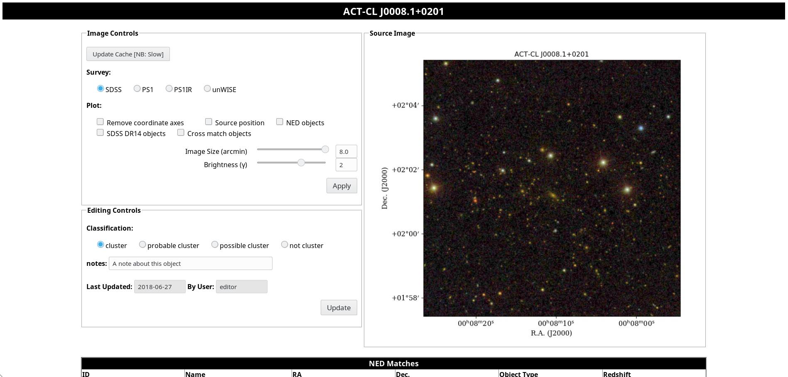
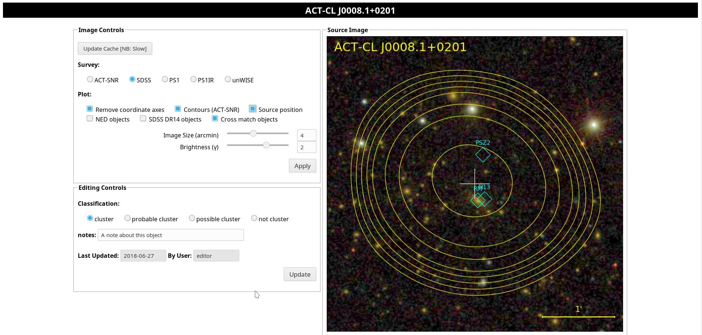

# Running Sourcery: ACTPol E-D56 cluster catalog example

Here is an example of how to use Sourcery to serve a web database
containing the [two-season ACTPol E-D56 cluster catalog](http://adsabs.harvard.edu/abs/2017arXiv170905600H).
This tutorial covers running the database locally on your machine,
using cherrypy's built-in webserver - see ADD_LINK for a description
of how to deploy Sourcery on Apache.


## The configuration .yml file

All of the options for Sourcery are controlled from a YAML file - 
this directory contains an example called `E-D56Clusters.yml`. This
file has comments that describe what each of the options does. We
will go through switching these on in turn, but for now, we will 
start with simply setting up and serving a database that anyone can
access.


## Creating the database

Sourcery works by creating a MongoDB collection (which we will call
a "database") from a number of input .fits table files. The primary
.fits table is specified using the `catalogFileName` parameter in 
the .yml file. This may then be cross-matched against other 
.fits catalogs and a MongoDB collection of editable fields 
(see later). To create the database, run:

```
% sourcery_build_db E-D56Clusters.yml
```

Building the database itself (in this case) takes ~2 seconds, but 
this script will then also proceed to build an image cache. As 
specified in the .yml file, this will download images from SDSS,
unWISE, PS1, and fetch information from NED also. It may take a while
to run (~45 minutes, depending on your network speed). Fortunately,
this only needs to be done once - and if you later update your
input catalog, you will only need to fetch imaging and data for new
objects that were added.

If there are any network problems while this is running (e.g., 
an error message like 'Connection reset by peer' appears), 
then you can resume building the cache from where it left off by 
running:

```
% sourcery_build_cache E-D56Clusters.yml
```

Once this is complete, you can test the database by running:

```
% sourcery_test E-D56Clusters.yml 
> Point your browser at http://localhost:8080/sourcery
```

You should see a table page like Fig. 1 below when you navigate to
<http://localhost:8080/sourcery> using your web browser:



If you click on one of the links, you should find yourself presented
with a page that contains all of the data on the object in the catalog,
including the images we specified, as in Fig. 2 below:



Note that the images pulled from the SDSS DR13 webserver are pretty dark
by default, and you will probably need to crank up the brightness using the 
slider, as shown.

When you are finished, you can terminate `sourcery_test` using `Ctrl-c`.


## Classifications, editable fields, and access control

Sourcery allows you to specify arbitrary editable fields for the database,
which are stored separately, as well as object classifications (e.g.,
"cluster", "not a cluster"). These are cross-matched against the source 
catalog database at run time. The advantage of this approach is that it
enables you to swap-out the source catalog (pointed to by 
`catalogFileName`), re-run `sourcery_build_db`, and not lose any of the
additional information entered about any source using the Sourcery web
interface.

In the `E-D56Clusters.yml` file, there are some example entries that enable
these features, which are commented out. The entries to un-comment are:

```
userListFile
contactInfo
classifications
classificationDescription
fields

```

Including the `userListFile` parameter enables access control for Sourcery,
which is required to allow user-editable fields and classifications. The 
plain-text file pointed to by `userListFile`, in this case 
[E-D56Users.txt](E-D56Users.txt),  specifies the usernames, access rights,
and password hashes for users of the database. In this example, we simply
have two users: 

* `viewer`, who has the role `viewer` (cannot edit the user-editable fields,
  but can see everything), and has password `viewpassword`
* `editor`, who has the role `editor` (can edit user-editable fields and
  classifications), and has password `editpassword`

Now start Sourcery again using:

```
% sourcery_test E-D56Clusters.yml 
```

You will find yourself confronted with a page that requests a login and 
password. Try either of the above options, and navigate to a source 
information page, and you will see a number of other controls have appeared,
as in Fig. 3 below:



If you are logged in as 'editor', you can edit and save a note, as shown. You
will see this reflected on the index (table) page also, once you refresh it.

You can add additional users by editing the `E-D56Users.txt` file. To generate
the password hash, you can use the `sourcery_password_hash` script, and paste
the result into the `E-D56Users.txt` in the appropriate column.


## Adding cross match catalogs

The `E-D56Clusters.yml` contains an example of how to cross match against 
external catalogs, stored as .fits tables. To enable this, un-comment the lines
for the `crossMatchCatalogs` field. In this example, cross-matches are added
for several other cluster catalogs. The columns in the cross-match catalogs
are added to the MongoDB database as fields with `label_` prefixes. You must
re-build the database to be able to access them:

```
% sourcery_build_db E-D56Clusters.yml
```

This should take only a few seconds to run, as we have not changed any other
options, so the cache re-build will not need to download any new imaging.


## Image directories

Sourcery can also make images from user-supplied .fits images. For each entry
in `imageDirs` in the .yml file, Sourcery will search through all .fits images
placed in each directory, and create thumbnail images centred at each object 
position in the source catalog. In `E-D56Clusters.yml`, you can see how this
is applied to the ACTPol E-D56 clusters catalog. To use this, un-comment the
`imageDirs` and contour-related parameters in `E-D56Clusters.yml`, download 
the ACTPol signal-to-noise map, and place it in the `ACTMap` directory - i.e.,

```
% wget INSERT LINK
% mkdir ACTMap
% cp Arnaud_M2e14_z0p4#PRIMARY_SNMap.fits ACTMap/
```

Then rebuild the cache to extract the thumbnails:

```
% sourcery_build_cache E-D56Clusters.yml
```

If you now re-run `sourcery_test`, you will find that contour overlays are now
enabled - in this case showing the ACT S/N in the matched filtered map, centred
on the source (see Fig. 4).




## Further options

Sourcery can also add public imaging from the DES, KiDS and S82 surveys. However,
the latter rely on having created colour .jpg preview images of each tile of the
survey (we may add links to these later - KiDS DR2 clocks in at 11 Gb for images
that have been downsampled by a factor of 2 in resolution).
